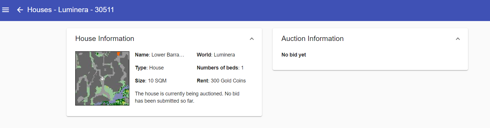
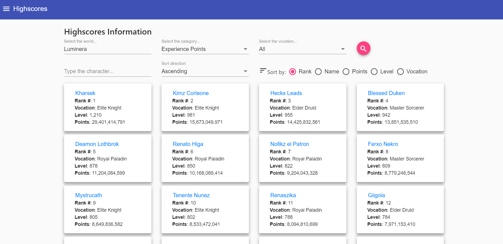

<h1 align="center">Tibia Info</h1>

A simple Tibia app that provides data in a convenient way.
## Screenshots

### Characters

  
  

### Worlds

  
  

### Guilds

  
  

### Houses

  
  

### Highscores

  

### News

  
  

## Installation
- Install IIS
- Install the dotnet core hosting
- Create the website in IIS, change the apppool .net clr  to: 'No Managed Code'
- Do a publish build (change the default folder to something like c:\\\TibiaInfo)
- Enjoy

## Copyrights
Tibia® is a registered trademark of CipSoft GmbH. 
Tibia and all products related to Tibia are copyright by CipSoft GmbH.
TibiaData API is developed by Tobias Lindberg in 2016-2018. All rights reserved.
